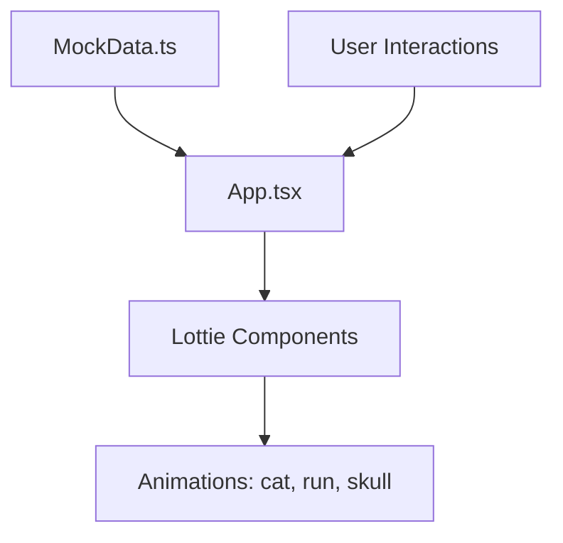

# 🚀 AURA - Dynamic Lottie Animation Showcase

[](https://react.dev/)
[](https://vitejs.dev/)
[](https://www.typescriptlang.org/)
[](https://lottiefiles.com/)

## ✨ Features
- **Smooth Lottie Animations**: Cat rocket, run cycle, skull boy.
- **React + Vite**: Fast HMR & builds.
- **TypeScript**: Type-safe code.
- **Responsive Design**: Works on all devices.
- **Mock Data Integration**: Dynamic content loading.

## 🎥 Live Demo
App running locally at [http://localhost:5173/Aura/](http://localhost:5173/Aura/)

## 📱 App Structure


## 🚀 Quick Start
```bash
cd frontend
npm install
npm run dev
```

## 🔧 Deployment
```bash
npm run build
npm run deploy  # Uses gh-pages
```

## 📁 Folder Structure
```
Aura/
├── frontend/     # React Vite app
├── public/       # Assets & animations
├── README.md     # This file!
└── .gitignore
```

## 🤝 Contributing
1. Fork the repo
2. Create branch: `git checkout -b feature`
3. Commit: `git commit -m 'Add feature'`
4. Push: `git push origin feature`
5. Open PR!

## 📄 License
MIT
