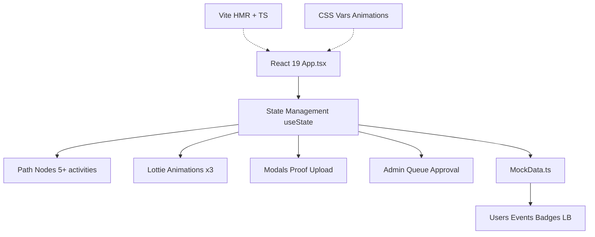

# 🚀 AURA - Campus Contribution & Gamification Platform

[](https://react.dev/)
[](https://vite.dev/)
[](https://typescriptlang.org/)
[](https://lottiefiles.com/)

<div align=\"center\">
  
  <br><br>
  
  
</div>

## 🎯 Project Overview

**AURA** is a **mobile-first student engagement dashboard** that gamifies campus contributions across domains like **Academic, Tech, Media, Events**. Students complete activities, submit proof, get admin-approved, earn **points/badges/streaks**, climb **leaderboards**, and collaborate via peer reviews.

### Key Workflows
```
Login → Activity Path → Submit Proof (AI Scan) → Admin Approval → Earn Points → Leaderboard → Share Progress
```

## 🏗️ Architecture & Tech Stack



## ✨ Core Features

### 1. **Activity Path System**
- **5+ Nodes** (e.g. 'Attend Event +20pts', 'Tech Seminar Q&A +15pts')
- States: `locked` → `active` → `pending` (proof sub) → `done` (approved)
- **Proof Upload**: File/folder + simulated AI originality scan
- Lottie animations per node (Rocket Sprint, Run Cycle, Skull Boy)

### 2. **Gamification Engine**
- **Daily Lucky Spin**: Random 10-50 pts
- **Surprise Missions**: e.g. 'Help 1 junior' +12pts
- **Streak Tracking**: 14 days visual pill
- **Badges**: 6 types (Q&A Contributor, Hackathon, etc.)

### 3. **Admin Dashboard**
- **Approval Queue**: Approve/reject submissions → award pts → unlock nodes
- **Path Editor**: Add/remove activities dynamically
- **Events Manager**: Create campus events (15pts registration)

### 4. **Social & Competitive**
- **Domain Leaderboards**: Academic/Tech/Media/Events ranks (gold/silver/bronze)
- **Users Directory**: Search/filter by domain/badges, peer review requests
- **LinkedIn Share**: Auto-generate progress post w/ points/streak/rank

### 5. **UI Components Library**
| Component | Props/Features | Screen |
|-----------|----------------|--------|
| **PathNode** | state, pts, Lottie side | Path |
| **Modal** | proof upload + AI scan | All |
| **LeaderboardRow** | rank badge, you highlight | Leaderboard |
| **SubmissionCard** | approve/reject actions | Admin |
| **Avatar** | dynamic color by name hash | All |
| **Notification** | auto-dismiss toast | Global |
| **ProgressBar** | animated fill | Profile |
| **WowCard** | Spin/Mission daily | Path |

## ⚙️ Key Functions & Methods

### Activity Completion Workflow
```tsx
// 1. Open node modal
const completeNode = (id: number) => {
  // Mark pending, add to admin queue w/ proof
  setPathNodes(prev => prev.map(n => n.id === id ? {...n, state: 'pending'} : n));
  // Auto-add submission w/ user details
};

// 2. Admin approval
const approveSubmission = (id: string, pts: number) => {
  setApprovedSet(new Set([...approvedSet, id]));
  setPoints(p => p + pts);  // Award pts
  // Unlock next path node
};
```

### Gamification Hooks
```tsx
// Lucky Spin
const playLuckySpin = () => {
  const reward = SPIN_REWARDS[Math.random() * SPIN_REWARDS.length];
  setPoints(p => p + reward);
};

// LinkedIn Share
const shareContributionOnLinkedIn = async () => {
  // Generate formatted post w/ points, streak, rank
  navigator.clipboard.writeText(postText);
  window.open(linkedinUrl);
};
```

## 📱 Screens Breakdown

1. **🧭 Path** - Main gamified progression + daily spin/mission
2. **📅 Events** - Register (15pts) or decline campus events
3. **🏆 Leaderboard** - Domain-filtered ranks w/ promo/demo tags
4. **👥 Users** - Search contributors for peer review
5. **🔑 Admin** (role-only) - Queue, path/events editor
6. **👤 Profile** - Stats, badges, progress bars, share button

## 🚀 Quick Start

```bash
# Clone & Install
git clone https://github.com/adithyayanamalamanda/Aura.git
cd Aura/frontend
npm install

# Development (localhost:5173/Aura/)
npm run dev

# Build & Deploy (gh-pages)
npm run build
npm run deploy
```

## 🛠️ Build & Customization

| Script | Purpose |
|--------|---------|
| `npm run dev` | Vite dev server + HMR |
| `npm run build` | Production build → `/dist` |
| `npm run preview` | Local preview built app |

**Dynamic Features**:
- Add path nodes via Admin → instantly live for students
- New events → students register (-15pts)
- Custom domains/badges via mockData.ts

## 📁 Project Structure
```
Aura/
├── frontend/          # React Vite SPA
│   ├── src/
│   │   ├── App.tsx    # Main app logic (500+ lines)
│   │   ├── mockData.ts # All data: nodes/LB/users
│   │   └── App.css    # Tailwind-free CSS vars/animations
│   ├── public/        # Logo + Lottie .lottie files
├── .gitignore         # Node/Vite standard
└── README.md          # You're reading it!
```

## 🎨 Design System
- **Colors**: Yellow (#FFD600) primary, Green rewards, CSS vars
- **Animations**: Shimmers, pulses, Lottie, CSS keyframes (60+)
- **Responsive**: Mobile-first max 480px
- **Fonts**: Nunito + Fredoka One (Google Fonts)

## 🤝 Contributing
1. Fork → `git clone + install`
2. Branch: `git checkout -b feat/cool-thing`
3. PR to `main` with screenshots/demo

**Good First Issues**: Custom badges, real backend API, PWA.

## 📸 Screenshots


**Live Demo**: http://localhost:5173/Aura/

## 📄 License
MIT - Free to use/modify/deploy!
